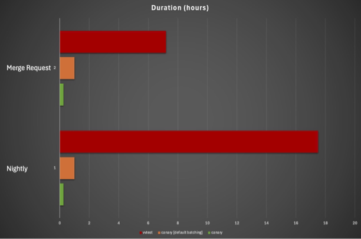

How does Canary perform?
------------------------

.. code-block:: console

    $ ctest -j16
    100% tests passed, 0 tests failed out of 1255
    ...
    Total Test time (real) = 164.17 sec
    $ canary run -w --workers=16 .
    ...
    INFO: 1250/1250 tests finished with status PASS
    INFO: Finished session in 125.73 s. with returncode 0
    $ canary dist run -w --server HOST:PATH --batch-count=40 --workers=40 .
    ...
    INFO: 1250/1250 tests finished with status PASS
    INFO: Finished session in 64.86 s. with returncode 0
    $ canary hpc run -w --scheduler slurm --batch-count=40 --workers=40 .
    ...
    INFO: 1250/1250 tests finished with status PASS
    INFO: Finished session in 44.86 s. with returncode 0

.. revealjs-break::

